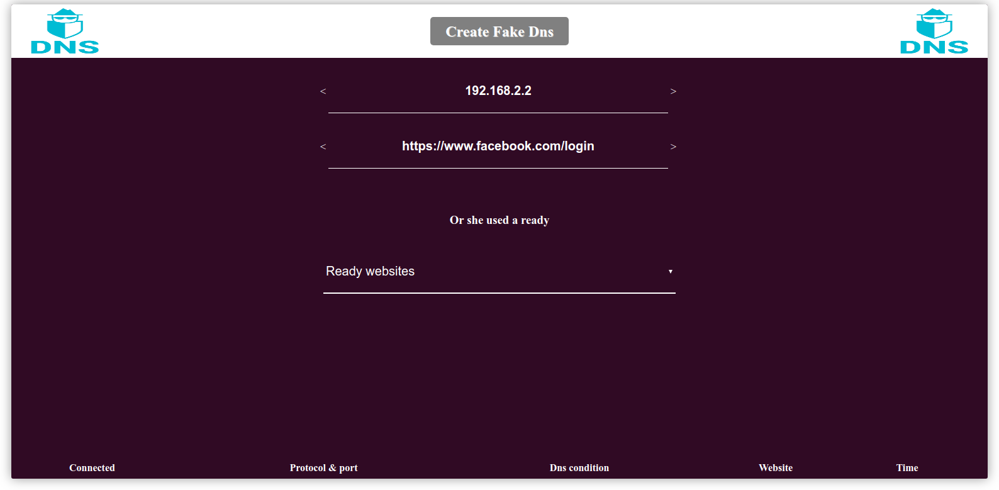
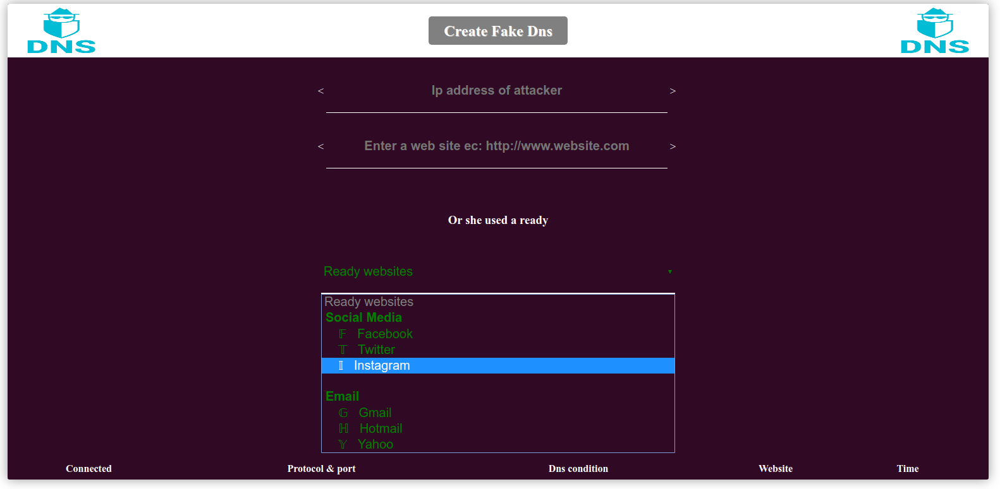
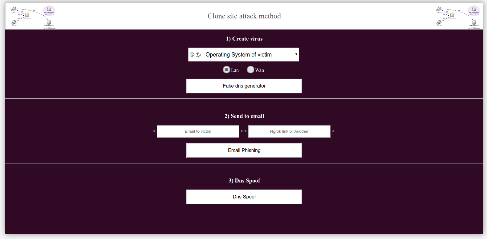
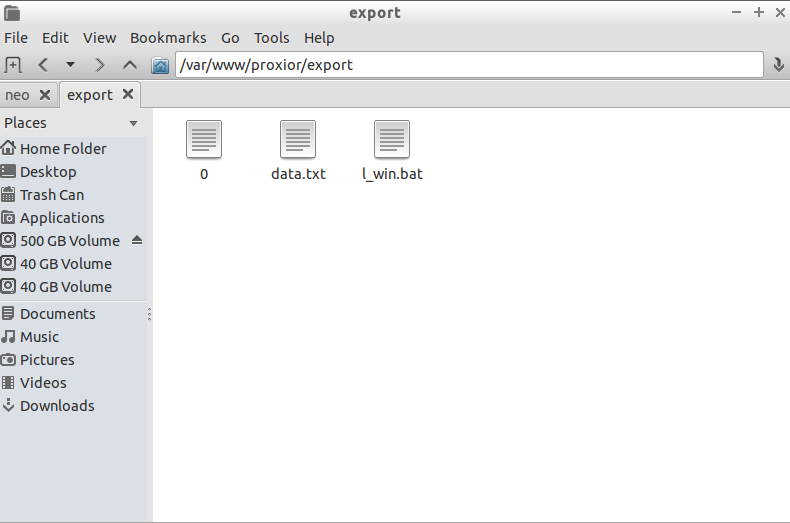
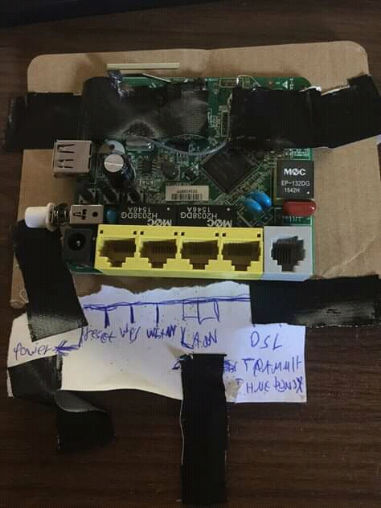
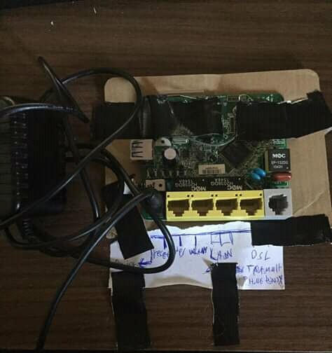
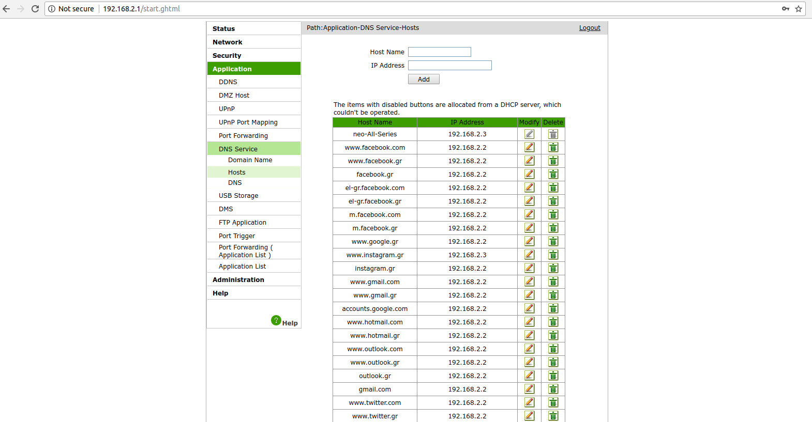
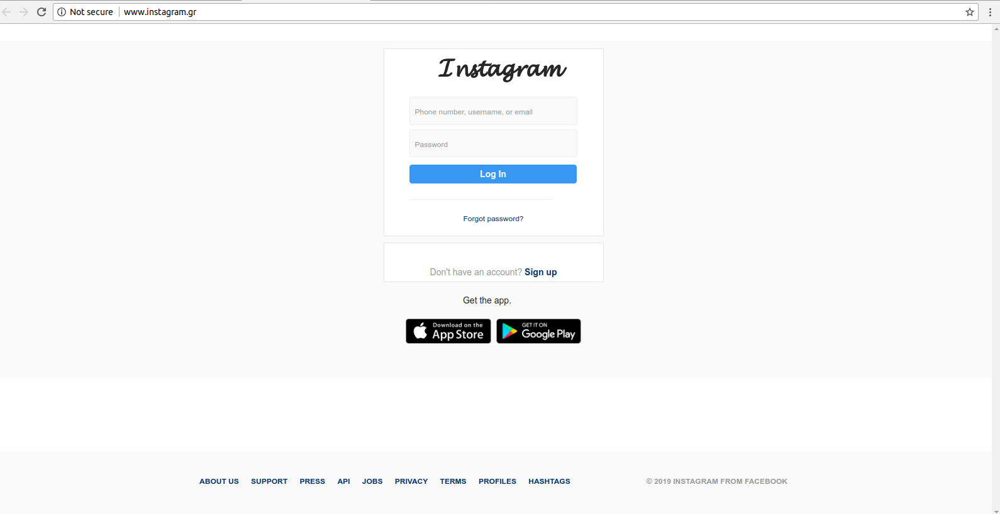
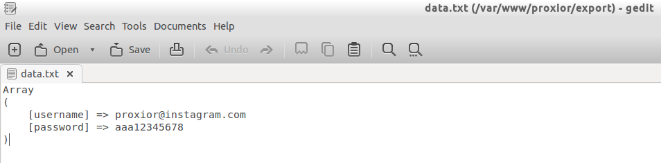
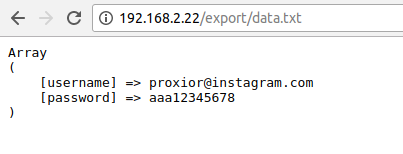

# proxior
program for poisoning and spoofing dns.  

 Download the programm and paste folder proxior in to /var/www/  

This program have   

i) Any website clone for manual method  

  a) insert the ip of attacker  
  b) insert a name of a web site and press enter  
  c) The web site it must have http or https protocol  
     Right: http://www.example.com or http://example.com  
     Wrong: www.example.com or example.com  
     
    

 ii) Ready web sites (social media and email)  
 
 a) socail media (facebook,instagram,twitter)  
 b) email (gmail,hotmail,yahoo)  

    

Three attack methods  

    

a) Fake dns generator for create batch file for computer of victim  
   To find the batch file go to /export/l_win.bat     

    

b) Email phishing with ngrok link  
 After install the ngrok in same folder  
 Install ngrok from here https://ngrok.com/  
 Run th script and clone any website    
 
 !Notice.. For using email phishing method open the file settings.txt  
 Insert the details your account email (need a email account for send fake emails)  
 e.x  
 email@gmail.com  
 password123456   
 Default seetings working for gmail accounts. If you want using another mail change the mail settings from file settings.txt  
 #settings for email server informations  
 debug: 0  
 authentication: true  
 tls or ssl: tls  
 host: smtp.gmail.com  
 port: 465 or 587   
 
    

 
c) Dns Spoof (Spoofing and poisoning DNS with hardware device)  
   For this method insert in to device the the dns for spoof  
   For your ip view in to the connection informations or enter ifconfig on terminal
   For first operation and second operation your use the ip from eth0 
   For third operation roque wifi use the ip from wlan0 
   e.x  
   dns: www.gmail.com  
   ip: 192.168.2.2  
   
   This device username and password details.  
   username: proxior  
   password: proxior  
   
   For create new fake dns follow this steps  
   Insert into device: getaway: 192.168.2.1 username: proxion pass: proxion   
   Go to Application -> DNS Service -> Host  
   Insert into Host Name field the dns for spoof e.x www.instagram.gr  
   Insert into IP Address field the ip from your server e.x 192.168.2.2  
   Press add. Dns spoof registered    
   
     
      
      
       

   
   You can use this device for three operations  
   
   First operation is router. Connect to dsl cable in to dsl port in device  
   
   Second operqtion is acces point with cable. Connect lan port from device with lan port yo router  
   After disable dchp server form device and give ip = 192.168.2.253 and subnet mask = 255.255.255.0  
   
   Third operation is created a roque wifi with no internet connection  
   !Attention! The wifi must be open... NO KEYS NO ENCRYPTION..... FREE WIFI    
   
   For create new attack method or create new atack for begin with different site   
   Enter clear.php in browser address bar after ip or url. your_ip/clear.php or fake_url/clear.php  
   e.x 192.168.2.2/clear.php or www.facebook.gr/clear.php    
   
   For view steal accounts there are two methods  
   First method open the file data.txt where is it in export folder (export/data.txt)  
   Second method enter the browser address bar your_ip/export/data.txt or fake_url/export/data.txt  
   e.x 192.168.2.2/export/data.txt or www.facebook.gr/export/data.txt    
   
     
       

  

   How it works

 
